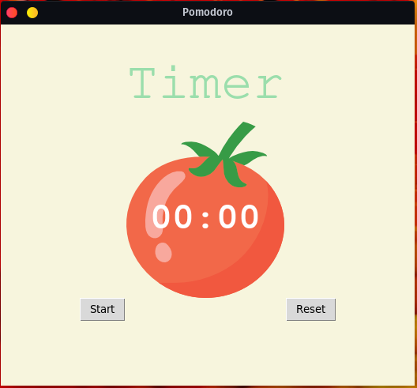

# Python Pomodoro Timer with Tkinter

A simple and efficient Pomodoro Timer application built using Python and Tkinter. The Pomodoro Technique is a time management method that helps users break their work into intervals, traditionally 25 minutes in length, separated by short breaks. This Python-based Pomodoro Timer will help you stay focused and productive throughout your workday.

## Features

- Customizable work and break intervals
- Start, pause, and reset timer functionality
- Visual and audio notifications for work and break periods
- Minimalist and user-friendly interface
- Cross-platform compatibility

## Installation

1. Make sure you have Python 3.x installed on your system. You can download Python from the official website: https://www.python.org/downloads/
2. Clone this repository to your local machine using `git clone https://github.com/yourusername/python-pomodoro-tkinter.git`
3. Navigate to the project directory using `cd python-pomodoro-tkinter`
4. Run the Pomodoro Timer application using `python pomodoro_timer.py` (or `python3 pomodoro_timer.py` on some systems)

## Customization

You can customize the work and break intervals by modifying the `WORK_TIME` and `BREAK_TIME` variables in the `pomodoro_timer.py` file.

## Contributing

We welcome contributions to improve this project! Please feel free to submit issues for bug reports, feature requests, or any other improvements. If you'd like to contribute code, please submit a pull request with a clear description of your changes.

## License

This project is licensed under the MIT License. See the [LICENSE](LICENSE) file for details.